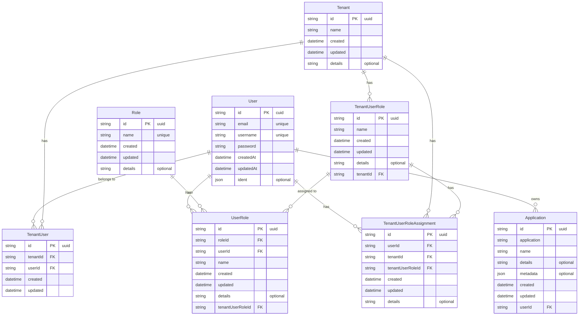

# Database Schema Documentation

## Overview
The database schema is designed to handle multi-tenant user management with role-based access control (RBAC). It supports applications, users, tenants, and a sophisticated role management system.

## Entity Relationship Diagram

## Schema Details

### User
- Core user entity with authentication details
- Stores basic user information and credentials
- Links to applications, roles, and tenant memberships

### Tenant
- Represents an organization or workspace
- Can have multiple users and roles
- Supports hierarchical role management

### Role
- Global roles that can be assigned to users
- Independent of tenants
- Used for system-wide permissions

### UserRole
- Links users to roles
- Associates roles with specific tenants through TenantUserRole
- Prevents duplicate role assignments

### TenantUser
- Represents user membership in tenants
- Tracks when users joined tenants
- Enforces unique user-tenant relationships

### Application
- Represents applications owned by users
- Stores application metadata and details
- Links to specific users

### TenantUserRole
- Tenant-specific roles
- Can be assigned to users within tenants
- Supports tenant-level permissions

### TenantUserRoleAssignment
- Links users to tenant-specific roles
- Tracks role assignments within tenants
- Prevents duplicate role assignments

## Key Features
1. Multi-tenancy support
2. Hierarchical role management
3. Flexible application ownership
4. Granular permission control
5. Audit trails through timestamps
6. Optional metadata storage
7. Unique constraint enforcement
